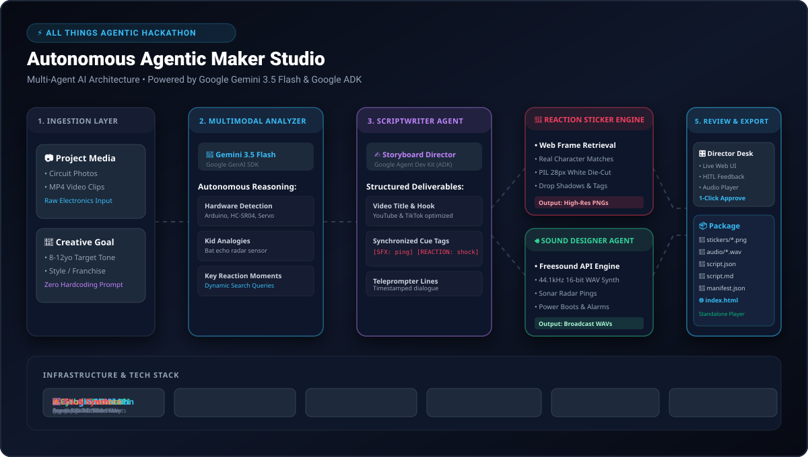
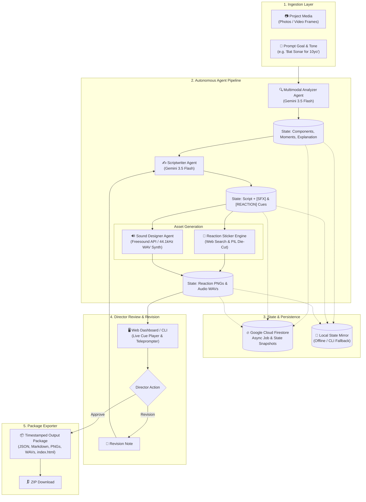

# 🏛️ Autonomous Agentic Maker Studio — Architecture

An autonomous multi-agent pipeline designed for the **Taskmaster Track** in the **Google "All Things Agentic" Hackathon**. It converts raw electronics/robotics project media into structured, kid-friendly (~8-12yo) video tutorial assets.

---

## 1. System Architecture Overview

<p align="center">
  
</p>



---

## 2. Specialized Agent Pipeline Matrix

| Agent | Technology | Input | Output / Role |
| :--- | :--- | :--- | :--- |
| **Multimodal Analyzer Agent** (`analyzer.py`) | Gemini 3.5 Flash (`google.genai`) | Circuit photos/video + goal prompt | Project Name, Kid Explanation, Components Checklist, 3-5 Key Reaction Moments |
| **Scriptwriter Agent** (`scriptwriter.py`) | Gemini 3.5 Flash (`google.genai`) | Project metadata + Key moments | YouTube/TikTok Title & Description, Full teleprompter dialogue with inline `[SFX: ...]` and `[REACTION: ...]` cue markers |
| **Real Anime Sticker Engine** (`sticker_artist.py`) | Web Image & Anime Search + PIL Die-Cut Engine | Character names, emotions & reaction prompts | Real anime character reaction frames (e.g. *Mikasa Ackerman angry*, *Eren in shock*, *Anya shocked*, *Luffy victory*) processed into die-cut vinyl stickers |
| **Sound Designer Agent** (`sound_designer.py`) | Freesound API + 44.1kHz Procedural Audio Synthesizer | SFX queries & moment cues | High-fidelity sound effects (.WAV/.MP3) for radar sonar pings, power boots, alarms, and victory fanfares |
| **Director Orchestrator** (`orchestrator.py`) | Google ADK / State Machine Engine | Agent outputs & user actions | Manages state machine (`PENDING` → `ANALYZING` → `SCRIPTING` → `GENERATING_ASSETS` → `AWAITING_APPROVAL` → `APPROVED`) |
| **Package Exporter** (`exporter.py`) | Python File & Asset System | Final approved job state | Timestamped folder with `script.json`, `teleprompter_script.md`, `manifest.json`, `stickers/`, `audio/`, and interactive `index.html` player |

---

## 3. State Machine & Data Flow

```text
[PENDING] (Job Created, Media Uploaded)
   │
   ▼
[ANALYZING] (Gemini Multimodal extracts circuit components & 3-5 key moments)
   │
   ▼
[SCRIPTING] (Gemini crafts kid-friendly teleprompter script with [SFX] & [REACTION] tags)
   │
   ▼
[GENERATING_ASSETS] (Concurrent generation of reaction stickers & 44.1kHz audio files)
   │
   ▼
[AWAITING_APPROVAL] ◄─────────────────────────┐
   │                                          │
   ├──────► [REVISING] (Feedback Note) ───────┘
   │
   ▼
[APPROVED] ──► Package Exporter generates timestamped bundle & manifest
```

---

## 4. Google Cloud Infrastructure Readiness

### Google Cloud Firestore
- Serves as the persistent **agent memory** across asynchronous pipeline stages.
- Every state transition, metadata update, and generated asset path is recorded in the `maker_tutorial_jobs` Firestore collection.
- Enables seamless polling from web and mobile clients.
- Graceful local JSON fallback ensures the system works offline and in local CLI mode without GCP credentials.

### Google Cloud Run
- Containerized FastAPI application deployed on managed Cloud Run infrastructure.
- Features:
  - Autoscaling (0 to 5 instances)
  - Gen2 execution environment with 2 vCPU / 2GiB RAM
  - REST endpoints for job creation, status polling, revision feedback, and package download.
  - Hosts the real-time glassmorphic Web Studio dashboard.

---

## 5. Synchronized Cue Tag Format

- `[SFX: cue_name]`: Triggers a synchronized audio event (e.g. `[SFX: sonar_radar_ping]`).
- `[REACTION: character_emotion]`: Triggers an on-screen reaction sticker beat (e.g. `[REACTION: mikasa_focused_glare]`).
- **Die-Cut Styling**: Features transparent background, crisp white die-cut vinyl sticker border, and character emotion caption tag.
